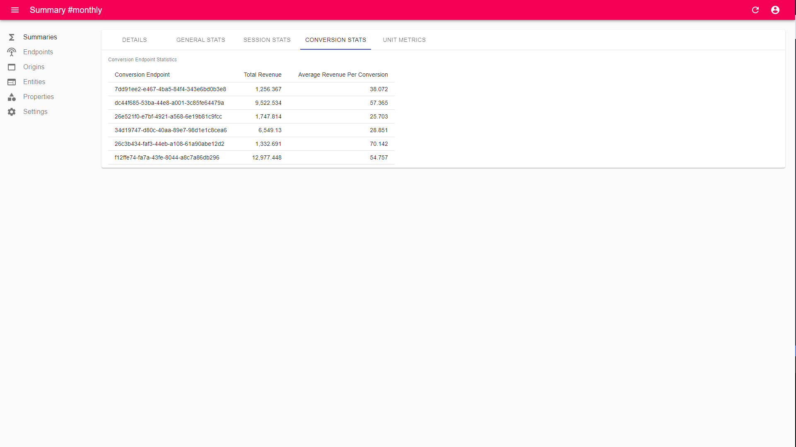

# Engauge



## Concept

Track user interactions in your apps and products in real-time and see the corresponding stats in a simple dashboard.

Allows for custom instrumentation of applications/products by utilizing a simple and consistent data format.

<!-- Interactions format -->
```go
type Interaction struct {
    // how
	Action *string // required

	// what
	EntityType *string
	EntityID   *string

	// where
	OriginType *string
	OriginID   *string

    // who
	UserType *string
	UserID   *string // required

	DeviceType *string
	DeviceID   *string

	// when
	Timestamp  *string

	// metadata
	Properties map[string]interface{}
}
```

The *only required fields* are `action` and `userID`. All other fields are optional to be sent in an interaction.

## Features

- Automatic Session Detection
- All-Time Statistics
- Interval-Based Statistics
  - Hourly
  - Daily
  - Weekly
  - Monthly
- Unit Metrics

## build from source

Only a build-from-source option will be made available in the open-source version of Engauge. It's still really simple!

Use `make build` for a linux binary build. The binary (named `engauge`) will be placed in a created `bin/` directory inside the repository root directory.

The binary is completely self-contained.

## self-host

Deploying the engauge service is super simple.

Make sure a domain (or subdomain) e.g,. `example.com` or `sub.example.com` are pointed at the VPS instance that you will be deploying Engauge on.

Then, just copy the binary to your favorite VPS instance, set your environment variable values in the start command and start it up (likely using `nohup`, `screen`, or `systemd`).

The start command should look something like this:

```sh
ENGAUGE_HTTPS=true ENGAUGE_BASEPATH=engauge-data ENGAUGE_USER=admin ENGAUGE_PASSWORD=my-super-secret-admin-p@$$WorD! ENGAUGE_JWT=jwt-secret-key ENGAUGE_APIKEY=my-secret-api-key ./engauge
```

You can use `make windows` for windows binary builds.

Engauge does output logs if you would like to capture those using a logging daemon (but this is completely optional).

It also comes with a health-check endpoint `/health` that will return a simple `alive` string value if you want to monitor it externally.

### environment variables

- `ENGAUGE_HTTPS` can be used to specify if Engauge should use HTTPS (RECOMMENDED to be set to true, defaults to false)
- `ENGAUGE_BASEPATH` is used to specify the name of the root directory in the local filesystem to store data.
- `ENGAUGE_TIMEZONE` specifies the default timezone for Engauge, defaults to the local timezone of the Engauge service instance.
- `ENGAUGE_SESSIONDELAY` specifies, in minutes, how long to wait after the last seen interaction for a user before considering that user's session to be completed.
- `ENGAUGE_USER` is the admin username
- `ENGAUGE_PASSWORD` is the admin password
- `ENGAUGE_JWT` is the JWT secret key
- `ENGAUGE_APIKEY` is the API key for sending interactions to the Engauge service

## Special Values

- `action`s:
  - `conversion`s will be counted towards conversion counts, and will be searched for an `amount` property key for unit metric analytics
- Property Keys:
  - `amount` key, expected to be a numerical value

## Sending Interactions

After you have found the locations within your app or product that you would like to gather data from (we call these "Endpoints"), you will simply need to send the data via HTTP/JSON.

Just send a `POST` to the `/api/interaction` route with your json-encoded interaction object in the request body (and your api key in the `api-key` header).

Easy as pie.

For example:

```sh
curl --location --request POST 'https://example.com/api/interaction' \
--header 'api-key: my-api-key' \
--header 'Content-Type: application/json' \
--data-raw '{
    "action": "close",
    "entityType": "list",
    "entityID": "list-2",
    "originType": "page",
    "originID": "page-2",
    "userType": "customer",
    "userID": "c9449105-9b01-4385-aab5-b45ce4948b96",
    "deviceType": "desktop-web",
    "deviceID": "d396bded-70a6-46ac-bff6-7e09394c43e0",
    "properties": {
        "browser": "safari",
        "browserVersion": "0.8.6",
        "country": "germany",
        "language": "it",
        "mobile": "false",
        "os": "macos",
        "path": "/page-2",
        "ref": "ddg",
        "screenHeight": 200,
        "screenWidth": 600,
        "userAgent": "b0a63af7-4431-4355-9143-cd75c5a6852a"
    }
}'
```

or

```http
POST /api/interaction HTTP/1.1
Host: example.com
api-key: my-api-key
Content-Type: application/json
Content-Length: 686

{
    "action": "close",
    "entityType": "list",
    "entityID": "list-2",
    "originType": "page",
    "originID": "page-2",
    "userType": "customer",
    "userID": "c9449105-9b01-4385-aab5-b45ce4948b96",
    "deviceType": "desktop-web",
    "deviceID": "d396bded-70a6-46ac-bff6-7e09394c43e0",
    "properties": {
        "browser": "safari",
        "browserVersion": "0.8.6",
        "country": "germany",
        "language": "it",
        "mobile": "false",
        "os": "macos",
        "path": "/page-2",
        "ref": "ddg",
        "screenHeight": 200,
        "screenWidth": 600,
        "userAgent": "b0a63af7-4431-4355-9143-cd75c5a6852a"
    }
}
```

where you will need to replace `example.com` with your Engauge instance domain.

## Roadmap

Many more features for Engauge are currently in progress and/or in planning.

Stay tuned!

## Open-source, not open-contribution

We apologize for having to do this, but Engauge is **closed to code contributions** (at this time). This keeps the code base free of proprietary or licensed code.

The Engauge team is too small to be accepting and maintaining third party patches for now. Small contributions typically require hours of time to properly test and validate.

**However**, we are tremendously grateful to the community for any feature requests, ideas, discussions, bug reports, and general involvement!
